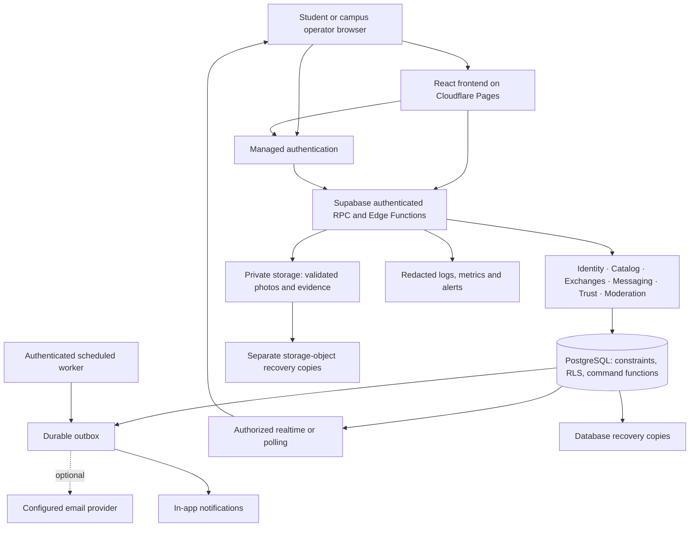

# Architecture and behavioral contracts

Proposed architecture, not an existing system. No executable schema or application code is included.

## 1. Recommended system

Use a React + Vite + TypeScript frontend on Cloudflare Pages Free. Supabase Free provides PostgreSQL, managed authentication, private storage, authorized realtime and narrow Edge Functions where secrets or processing are needed. Database command functions enforce workflow invariants. GitHub hosts source and triggers deployment. Backend domains form one modular system. In-app notifications are baseline; extra email requires a configured free sender. This uses the React option in the source diagram and avoids a server-rendered host for private campus screens.

Logical modules are not independently deployed microservices. Cloudflare serves static files and TLS; it does not automatically protect direct Supabase traffic. RPC/Edge entry points need their own authorization, validation and rate limits. No secrets belong in the Vite bundle. The Supabase URL and publishable key may be public only because grants/RLS protect data. A separate API gateway, Redis, Kafka, Kubernetes and Elasticsearch are not baseline requirements.

## 2. Decision records

| ADR | Decision and reason | Alternative / accepted cost | Revisit trigger |
|---|---|---|---|
| 001 | Modular monolith: transaction consistency and a small team's operability matter most | Microservices add deployment, tracing and distributed consistency work | A measured independent scaling/ownership boundary justifies extraction |
| 002 | PostgreSQL: relational membership, reservations, reviews and constraints | Document database would require more application integrity work | Unusual non-relational workload is proven |
| 003 | Managed auth/storage/database reduce infrastructure chores | Provider dependence and ongoing cost; self-hosting adds patching/recovery burden | Institutional hosting rules, cost evidence or exit requirement |
| 004 | React/Vite static hosting plus Supabase command backend fits zero budget and private screens | Next.js/Vercel is a later alternative; its server runtime and hosting decisions are unnecessary here | Public SEO/server rendering or measured requirements justify it |
| 005 | SQL search plus category/filter indexes initially | External search adds synchronization and cost | Representative corpus misses latency/relevance targets after query tuning |
| 006 | Durable DB outbox; provider realtime with polling recovery | Dedicated queue/cache adds another operated system | Queue delay or database load exceeds agreed SLO |
| 007 | Private media and scoped delivery | Slightly more URL/caching complexity than public buckets | Public catalog is explicitly approved with a privacy assessment |
| 008 | Direct payment with private proof and seller acknowledgement; no gateway | Cannot verify bank settlement or automatically refund | Approved provider and settlement design for a future gateway |
| 009 | Single-campus operation; campus identifiers from day one | Modest schema cost without cross-campus UX | A second institution signs up and isolation tests pass |
| 010 | Shared components with theme tokens | Themes cannot independently rearrange critical flows | Observed usability need justifies a documented layout variation |
| 011 | Privileged workflow fields mutated only through narrow DB command functions | More deliberate SQL permission design than generic CRUD | Never bypass without equivalent database-enforced invariants |

At P00 validate supported compatible versions, record exact versions and one package-manager lockfile. Do not copy stale skill syntax or unreviewed latest tags. Relevant sources: [Cloudflare Pages limits](https://developers.cloudflare.com/pages/platform/limits/), [Supabase RLS](https://supabase.com/docs/guides/database/postgres/row-level-security), [PostgreSQL ranges](https://www.postgresql.org/docs/15/rangetypes.html). The Next.js research in document 01 evaluates an alternative; it does not authorize Next.js scaffolding.

## 3. Logical repository organization

The future implementation should have separate areas for route entry points, shared accessible UI, semantic design tokens, domain modules, infrastructure adapters, database migrations, tests, operational documents and evidence. Within a domain, keep validation/contracts, permissions and operations together. Route handlers call domain operations instead of duplicating rules. Do not create layers that merely forward every function without enforcing a boundary.

Domains: identity/membership, catalog/media, availability/exchanges, payment-evidence, handoff/condition, messaging/notifications, trust, moderation and account privacy. Payment-evidence is current; gateway adapters remain deferred.

## 4. Data dictionary and invariants

All timestamps are timezone-aware; use UTC storage. Monetary values use integer minor units with currency. IDs are opaque. Campus scoping must be enforced through relational constraints and authorization, not just query filters. Important mutable aggregates have a version for optimistic concurrency.

| Entity | Minimum information | Invariants / access |
|---|---|---|
| Campus | Name, code, status, timezone, policies and confirmed pickup zones | Only operators change; no student-supplied campus activation |
| Campus email domain / invite | Exact normalized domain or hashed invite, scope, expiry | Operator-controlled; invites single-use; no publicly downloadable roster |
| Profile | Auth user ID, display name, avatar reference | Separate publicly shareable campus fields from private contact/enrollment data |
| Membership | User, campus, student eligibility, status, method, expiry, verification actor | One per user/campus; student cannot write role or verification state |
| Role assignment | User, campus, role, granted/revoked actor and dates | Bootstrap out-of-band; MFA and audit for admin changes |
| Preference | User, style, appearance, motion, density, onboarding completion | Owner-only; schema-validated choices; safe defaults |
| Policy acceptance | User, policy/version, accepted time and notice context | Append-only record; no prechecked consent invented |
| Asset | Campus, physical owner, basic identity, lifecycle | One real item concept; same-campus owner membership |
| Listing | Asset, one mode, title, description, condition/defects, amount/rate, category, status, version | One non-archived listing per asset; amount matches mode; owner editing rules |
| Listing media | Listing, private storage key, dimensions, validation status, order | Published listing only references validated media; campus-scoped read |
| Availability window | Asset, allowed interval, blackout or policy | UTC bounds; positive duration; edits cannot invalidate accepted terms |
| Exchange request / transaction | Listing, asset, campus, owner, requester, mode, times, state, accepted quote snapshot, version | Parties distinct and eligible; immutable owner/requester; valid state transition |
| Reservation | Transaction, asset, interval with turnaround, blocking status | No overlapping blocking temporary reservations; exclusive sale hold |
| Term revision | Transaction, proposer, dates/amount, acceptance actors, version | Accepted snapshot immutable; extensions are new accepted revisions |
| Handoff session | Transaction, pickup/return phase, token hash, expiry, consumption time, initiator | One live session per phase; actor, phase and version bound; no raw token storage |
| Condition report | Handoff, author, structured checks, notes, immutable media refs, finalized time | Each party records own statement; finalization prevents overwrite |
| Handoff acknowledgement | Session, actor, condition-report revision, decision, timestamp | Unique actor/session; distinct participants; finalization verifies both |
| Custody event | Transaction, holder change, actor confirmations, time, phase | Append-only; condition disagreement is separate from physical receipt |
| Conversation | Campus, listing inquiry or transaction context, participants | Exactly authorized participants; no self-conversation or cross-campus join |
| Message | Conversation, sender, content, client message ID, created time, moderation state | Participant send/read; idempotent retry; sender cannot impersonate another |
| Block | Blocking user, blocked user, campus, time | Prevent new inquiries; preserve restricted existing-case resolution |
| Notification | Recipient, type, transaction/reference, created/read time | Recipient-only; content excludes secrets and private evidence URLs |
| Outbox job | Event ID, kind, payload reference, next attempt, attempts, lease, outcome | Durable, deduplicated; dead-letter visibility; no irreversible duplicate effect |
| Review | Transaction, reviewer, reviewee, stars, optional text, visibility/reason | One per actor/transaction; completed exchange and review window required |
| Payment proof | Transaction, payer, claimed amount/currency, private object key, version, optional masked reference, submitted time | Payer-only; no bank-verified flag; retention-limited prior versions |
| Payment acknowledgement | Proof/version, payee decision/time/reason | Payee-only; immutable command-bound event; uploader cannot approve own proof |
| Report / dispute | Campus, reporter, subject, category, state, assigned operator, resolution | Reporter and authorized case staff see scoped data; counterpart gets appropriate case notice |
| Moderation action / appeal | Subject, actor, reason, before/after state, appeal link | Append-only; human review; no unlogged “force success” |
| Idempotency record | Actor, operation, key, request hash, outcome reference, expiry | Reused key with different payload fails; same payload returns same outcome |
| Audit event | Actor, campus, action, subject, request ID, timestamp, redacted change summary | No student writes; tamper-resistant permissions; bounded sensitive access |
| Data request | User, export/delete type, state, verification, completion and exceptions | Own request; operator-managed processing; audited exception rationale |

Every child row associated with a transaction/listing must have a validated parent relationship and matching campus, using appropriate composite keys or equivalent checks. RLS alone does not ensure cross-table consistency.

**Index plan:** listings by campus/status/category/mode/created time; title/description full-text index; optional trigram title matching after measurement; reservations by asset/range; transactions by each participant/state/date; messages by conversation/created time/ID; outbox by due time/status; notifications by recipient/unread/time; cases by campus/status/priority. Check query plans on representative data, not an empty database.

**Delete behavior:** accounts can be de-identified according to policy while immutable operational evidence is retained only where justified. Active obligations cannot disappear through cascades. Media deletion must respect case holds and published retention rules. Do not retain every object forever “for audit.”

## 5. Permission matrix

| Object/action | Visitor/pending | Active same-campus student | Participant/owner | Moderator/admin |
|---|---|---|---|---|
| Published campus listings | Denied | Read limited data | Owner edits allowed fields | Moderate assigned campus |
| Draft/rejected listings | Denied | Denied | Owner only | Review under campus role |
| Student contact/enrollment info | Denied | Denied | Own minimum required fields | Verification role only, audited |
| Preferences | Denied except own authenticated account | Own only | Own only | No routine access |
| Create/request | Denied | Eligible member within limits | No self-request | Cannot impersonate student |
| Accept/cancel/extend | Denied | Denied unless participant | Role-appropriate command only | Case action with reason; not generic status edit |
| QR token/evidence | Denied | Denied unless participant | Phase-appropriate participant access | Scoped case evidence; raw tokens inaccessible |
| Payment proof | Denied | Denied unless participant | Payer uploads, both read, payee acknowledges | Assigned dispute staff only |
| Messages | Denied | Only allowed conversation | Read/send subject to block/status policy | Assigned report scope with access reason |
| Reviews | Denied | Published eligible reviews | Own eligible submission | Policy-based moderation |
| Reports/disputes | Denied except own authenticated help request | Create own | Own submitted case and appropriate party notice | Assigned campus cases |
| Roles, verification, audit | Denied | No mutation | Own verification status only | Least-privilege assigned operator; MFA |

Expired/suspended members use explicit restricted policies for existing obligations, account rights and staff-assisted returns. Do not grant broad campus reads as a shortcut. Realtime subscriptions and storage reads follow the same matrix as HTTP.

## 6. Command boundary and API contracts

Use authenticated HTTP commands for workflow mutations. Every command validates session, current membership/role, campus, object ownership/participation, payload, expected version, policy and rate limits. Authorization uses the authenticated actor, not a submitted `user_id`. Client validation improves UX but never grants authority.

Critical changes run through narrow database functions that lock the relevant aggregate, check invariants, write state + reservation + audit + outbox in one transaction and return an authoritative result. Revoke generic updates to state/role/campus/price snapshots/reservations/tokens. A participant must not bypass the app by calling the Data API directly. If a function requires elevated rights, restrict execution, fix its search path and re-check actor, role and campus inside it. Never use a broad service key as proof of end-user permission. [Supabase API keys](https://supabase.com/docs/guides/getting-started/api-keys).

| Operation | Input contract | Success / important failure |
|---|---|---|
| Read feed | Allowlisted filters, sort and opaque cursor; campus from membership | Bounded page of authorized listings; no unbounded export |
| Create/update listing | Own asset, details, validated media IDs, expected version | New authoritative version; conflict if reserved terms affected |
| Request exchange | Listing/version, times, note, idempotency key | Request + server quote + expiry; stale quote or invalid dates rejected |
| Accept request | Request/version, idempotency key | Atomic reservation + accepted snapshot; conflict if another acceptance wins |
| Cancel / decline | Transaction/version, reason, idempotency key | Valid terminal request/cancellation event; post-pickup cancellation rejected |
| Propose/accept extension | Transaction/version, new due time, accepted revised quote | No overlap; cannot silently charge extra |
| Start handoff | Transaction/version, pickup/return phase | Short-lived scoped challenge for expected recipient |
| Redeem challenge | Challenge, phase, transaction context | Opens acknowledgement step; does not alone complete handoff |
| Finalize handoff | Participant decision, immutable condition refs, expected phase/version, idempotency key | Both-party confirmation changes custody/state once |
| Submit payment proof | Transaction/version, validated private image, amount claim, optional masked reference, idempotency key | Payer only; wrong amount/state rejected; no auto-acknowledgement |
| Acknowledge/dispute receipt | Current proof/version, payee decision, idempotency key | Stale proof rejected; case created on disagreement |
| Send message | Authorized conversation, text, client message ID | Persisted message; duplicate returns original; forbidden participant rejected |
| Submit review | Completed transaction, stars/text | Stored eligible review; visibility follows bilateral/time policy |
| Report/resolve/appeal | Subject, reason, allowed evidence; resolution requires operator role/version | Case event and scoped notifications |
| Save preferences | Validated choices and version | Canonical preferences returned |
| Request export/deletion | Reauthenticated own account, request type | Tracked request; necessary holds stated and audited |

Error categories: unauthenticated, forbidden, not found, validation failure, conflict/stale state, rate limited and temporary dependency failure. Choose consistent HTTP codes and machine-readable domain codes; include safe field errors and a request ID. Use non-revealing not-found responses where existence is private. Do not return raw SQL, stack traces or token material.

For accept/cancel/handoff/extension commands, scope idempotency to actor + operation and bind to payload hash. Retain response references for at least the supported retry window; permanent state uniqueness remains even after idempotency retention ends. Version conflicts must return current safe state and require the user to review changed terms.

## 7. State machines

### Listing lifecycle

Draft → Pending review → Published. Rejection returns to an editable rejected state with reason. Published can become Paused, Moderation hidden or Archived. Changes to material published details require review. Availability is derived from reservations; it is not an editable “available=true” promise.

### Request and exchange lifecycle

| From | Allowed transition | Actor and guard | Atomic effects |
|---|---|---|---|
| Requested | Accepted | Owner; both memberships eligible; request live; availability valid | Reserve asset/time, freeze quote, notify |
| Requested | Declined / Withdrawn / Expired | Owner / requester / server clock | Close request with reason; no inventory held |
| Accepted | Canceled | Either participant before pickup | Release hold, invalidate pickup session, notify |
| Accepted | Pickup expired | Worker after grace; no completed or timely open handoff | Release hold once, notify; no unproven trust penalty |
| Accepted sale | Completed | Both final pickup acknowledgements valid | Record transfer, close sale listing, release hold, open review window |
| Accepted loan/rental | In progress | Both final pickup acknowledgements valid | Record borrower custody; keep reservation |
| In progress | In progress with revised terms | Extension explicitly accepted, no conflicts | Append term revision and update reservation atomically |
| In progress | Returned pending resolution | Both acknowledge physical return but disagree on condition | Record owner custody, lock case evidence, pause asset pending review |
| In progress | Completed | Both acknowledge physical return and condition agreement | Record owner custody, release reservation, open review window |
| Returned pending resolution | Completed | Authorized case resolution under policy | Record resolution; keep history; unblock asset only if safe |

Dispute is a related case state, not a replacement for custody state. A case can open while requested, accepted, active or completed. Opening a case must not erase due dates or who holds the item. Safety cases can block new trade while allowing staff-assisted return. Sale disputes after completion do not automatically reverse ownership.

Overdue is a derived active-state flag. If the item remains out, future accepted reservations cannot proceed just because their scheduled range starts; the pickup command checks actual custody. Future borrowers receive delay notice and an explicit cancel/reschedule route. The system never marks a return merely because time elapsed.

### Availability model

Use half-open intervals: start inclusive, end exclusive, plus a configurable turnaround buffer on temporary reservations. Equality at the buffered end is allowed; overlap is not. Sale acceptance requires the asset has no other active reservation; a sale-mode listing cannot coexist with a rental-mode listing for that asset. A database exclusion constraint or equivalent serialized invariant protects concurrent temporary bookings. Lock the asset row consistently for acceptance, mode changes and handoff to avoid race paths. [PostgreSQL ranges](https://www.postgresql.org/docs/15/rangetypes.html).

If accepting a sale, reject/close competing pending sale requests atomically or through an idempotent follow-up that leaves them clearly unavailable; none can subsequently reserve the sold asset. For rentals, non-overlapping future requests may remain eligible. Limit retries after serialization/deadlock failures and return a safe conflict if needed.

## 8. QR and condition protocol

1. Both participants open the authenticated exchange. Server verifies correct state, parties, membership or permitted existing-obligation access, custody and expected terms revision.
2. Owner starts pickup; borrower starts return. Server generates an opaque random challenge with at least 128 bits of entropy, bound to transaction, phase, expected redeemer and version; expiry proposed at five minutes. Store only its hash.
3. Display the challenge as QR. A typed fallback code is associated with the same session, at least 10 random unambiguous characters, scoped to the already authenticated transaction. Both paths consume the same challenge, with a proposed five-attempt limit per session and distributed actor/IP throttling.
4. The counterpart scans or enters the code. The server rechecks all bindings and records redemption once. Redemption opens a review screen; it does not prove receipt or condition.
5. Each party reviews the same frozen terms and finalized condition statements, confirms physical handoff/receipt and acknowledges agreement or disagreement. Updating evidence invalidates prior acknowledgements of the old version.
6. Only the server finalization operation can change custody/state when both distinct actors supplied valid acknowledgements. Pickup disagreement blocks normal completion and offers cancel/case handling; returned-item disagreement records custody separately as described above.
7. Replay, screenshot reuse, wrong phase, old terms, wrong participant, canceled transaction, expiry and concurrent redemption are rejected. Logs, analytics and notifications never contain raw challenges.
8. Offline: show “Connection required to confirm.” Never queue a critical finalization as if completed. Preserve harmless draft notes, then fetch authoritative state on reconnect. If participants proceed physically without confirmation, provide a clearly labeled staff-assisted reconciliation route with both statements and an audit reason; no backdated fake scan.

Photos and QR cannot prove that a depicted object is authentic, unchanged or physically present. The protocol produces evidence of authenticated statements. Do not market stronger guarantees.

## 9. Media, chat, jobs and search

**Media:** allow safe raster formats initially; inspect content rather than trust extension/MIME alone. Decode/re-encode to strip EXIF, enforce dimensions and byte limits, create safe derivatives and quarantine failed processing. Handle HEIC explicitly through a validated conversion dependency or explain unsupported input; do not silently lose phone photos. No arbitrary SVG/PDF uploads in baseline chat/listings. Original condition evidence is immutable after finalization; safe processed evidence must preserve relevant defects. Enforce upload owner, campus, object path and finalization authority. Short-lived signed URLs are bearer links: limit TTL (proposed five minutes), redact logs/referrers, and document bounded residual access until expiry after revocation. Highly sensitive evidence can be streamed through authorization on each read if necessary.

**Chat:** persist before broadcasting; authorized realtime is delivery assistance, not the source of truth. On reconnect fetch missing messages using stable cursor/order. Retries use client message IDs; unread state derives from a bounded last-seen cursor. Block and membership changes revoke new sending privileges immediately on server commands; subscriptions must be closed/rechecked. Restrict notification previews by default.

**Outbox:** commit jobs with the domain event. Worker leases rows, processes bounded batches and retries transient failures with backoff; use event dedupe keys for notifications and provider idempotency where available. At-least-once processing does not imply exactly-once email delivery. After a bounded attempt count (proposed eight), surface a dead-letter item to operators. Before sending a reminder, recheck whether its transaction still needs it. Server-side jobs require scheduler authentication and overlap protection.

**Search:** bind every query to authorized campus/status, cap query length, parameterize input, allowlist sort fields and paginate. Price filters distinguish sale amount from per-day rental rate. Date filtering is a preview; acceptance is the authoritative availability check. Never leak hidden results through counts, suggestions, caches or “not found” errors. Basic recommendations are explicit category/newness sorting; personalized AI is deferred.

## 10. Threat and failure register

| Failure or attack | Prevention / containment | Required evidence |
|---|---|---|
| Cross-campus or other-user ID substitution | RLS + grants + actor checks + relational scope | Real multi-identity negative API/storage/realtime tests |
| Role escalation or forged student status | Protected membership/role commands; no trusted client metadata | Direct Data API mutation denied |
| Multiple acceptances | Database lock/constraint + atomic command | Concurrent callers produce only legal reservations |
| Stale quote or changed dates | Frozen terms + expected version + re-acceptance | Old request cannot accept a new price silently |
| QR replay or token leak | Scoped hashed single-use token, short TTL, no logging | Wrong actor/phase/replay/concurrent tests |
| Malicious photo or resource exhaustion | Size/pixel/type/quota controls; safe decode | Invalid files and oversized decoded images fail safely |
| Stored XSS in listing/chat/review | Text escaping, safe URLs, restrictive content policy | Malicious text renders inert across screens |
| Email outage | Durable retry, in-app canonical state, operator alert | Failed provider does not undo accepted exchange |
| Realtime outage | Persistent message log and bounded polling | Reconnect recovers without duplicates or access leaks |
| Database outage | Safe unavailable state; no fake demo fallback | Mutations fail without “success” toast |
| Worker races cancellation | Recheck aggregate version/state; idempotent job | Canceled exchanges do not send actionable stale reminders |
| Theme cache crosses users | Account-aware canonical preference reconciliation | Sign out/in as another user shows their own preferences |
| Moderator abuse | Least privilege, MFA, case scope and immutable audit | Unassigned case denied and reason captured for access |
| Data loss | Separate DB/media copies; coordinated restore | Restore drill verifies evidence bytes and referential links |

## 11. Quality and capacity assumptions

Initial free-tier test corpus: 500 synthetic members, 500 active listings plus archived fixtures, 2,000 transaction records and 10,000 short messages. Include hidden records and a second synthetic campus strictly for isolation tests. Use a local/disposable test database and avoid loading large media into the hosted free project. This is a test envelope, not a forecast.

Proposed controlled-pilot gate after tomorrow: 25 concurrently active simulated sessions for 15 minutes, target 5 requests/second, after ramp-up; 70% reads/search, 20% chat reads/writes, 10% listing/exchange commands. Add separate hot-item races; distinct-item throughput cannot prove conflict correctness. Do not load-test Google/OTP or upload real receipts. Record p95 read ≤800 ms, p95 command ≤1,200 ms, <1% unexpected server errors, zero forbidden disclosure and zero integrity violations. Report expected conflicts/rate limits separately. 500 registered accounts does not mean 500 concurrent users. A 100-session/20-RPS growth scenario is deferred until capacity/quotas justify it.

These thresholds are proposed targets for the specified deployment, not promises. Record region, database tier, dataset, network conditions, generator version, duration, arrival model and actual throughput. If budget cannot support the target, reduce and disclose the supported launch envelope before inviting users.

Availability target after launch: 99.5% monthly for core journeys, with a defined measurement window and outage calculation. Recovery targets and staffing are in the operations document. An application build or a short load run does not demonstrate an uptime SLO.
